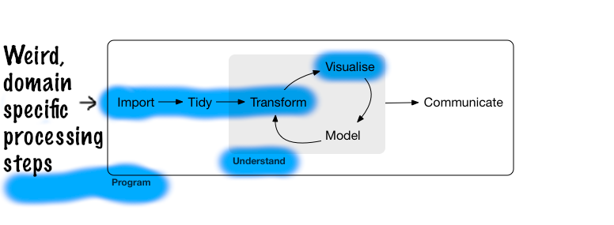
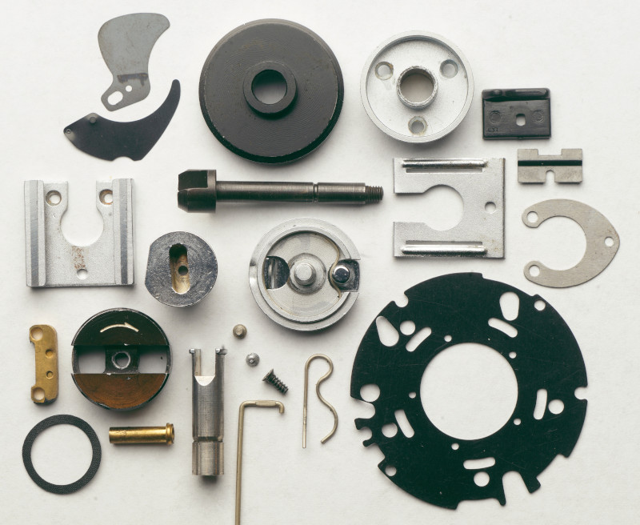

##

<div style="float: right">

<br><br><br>
<br>The **new** S language,
<br>published 1988.
</div>

R has a long history.

* S - 1976
* R - 1993

<br>
We will be focussing on the modern [Tidyverse](https://tidyverse.org) approach. 

* `dplyr`, `ggplot2`, `tidyr`, `purrr`, etc
* data frame ("tibble") is the one true data structure
   * "tidy data"
* mostly written by [Hadley Wickham](http://hadley.nz/)
* simpler, safer, and less "helpful"


## Analysis cycle

From the ["R for Data Science" book](http://r4ds.had.co.nz/)


Data analysis isn't just statistical modelling.

*The greatest value of a picture is when it forces us 
<br>to notice what we never expected to see.*

-- John Tukey


## Topics covered today

<br>



Communication and modelling covered in other workshops.


## Programming

Use structures such as loops to automate repetitive tasks:

```{r eval=F}
for(i in 1:10) {
    do_the_thing(i)
}
```

"Source" R scripts:

```{r eval=F}
source("myscript.R")
```

* runs script command by command to completion (or first error)

Define new functions for interactive or scripted use:

```{r eval=F}
source("myfunctions.R")
```

Variations:

* Use Rmarkdown to produce a document
* Write an R package


## Programming, from a scientist's perspective

If every step of your analysis is recorded in an R script, with no manual steps:

* you have a complete record of what you have done
* easy to run entire script with test data
* changes easily tested, poor early decisions easily fixed
* today's big project becomes a function in a package, serves as tomorrow's building block

<br>
Programming is an essential part of **reproducible research**.

* other researchers can precisely understand and verify your work

<!--
Elements of programming we will be looking at today:

* re-usable step-by-step procedures with `function`
* doing something "for each ..." with `for` loops
* making decisions with `if`
* running external software with `system`
* running all the code in a .R file as a "script", or to load a "library" of functions
-->


## Data


As your programs get more complicated, you will also need ways to represent complex data.

<br>
Often the largest task is to get the data into the right form to apply a tool such as `ggplot`, `summarize`, or `lm`.


## Data

### Vectors

* A collection of a single kind of data:<br>numeric, character, factor, logical
* Single numbers are a vector of length 1.
* Can have `names( )`.

### Lists

* A special kind of vector that can hold any kind of data, including other vectors and lists.
* If you need to bundle together a miscelaneous collection of data, lists are your solution. For example, a function that needs to return multiple results can return a list.
* Play the same role as both the `list` and `dict` types in Python or objects in Javascript.
* Access individual elements with `[[ ]]` or `$`.

## Data

### Data frames

* Data frames hold tabular data where the columns may be different types. 
* Under the hood, a list of column vectors. 
* Tidyverse has an improved data frame called a "tibble".

### Others (not covered today)

* **Matrices** hold tabular data all of the same type, usually numeric.<br>Distinct from data frames in R!<br>Can have `rownames( )` and `colnames( )`.

* **"S3" objects** are (usually) a list, with a special class attribute.<br>Example: an **lm** object holding a linear model.

* **"S4" objects** are a more formal approach to object-orientation.<br>Most heavily used by the Bioconductor project.<br>Example: a `GRanges` object holding genomic ranges.


## Tidy data



Tidy data doesn't mean tidy for a person to read, it means the easiest form for the computer to work with.

* only use data frames
* each row is a single unit of observation
* each column is a single piece of information
* each column is a distinct kind of information

Similar to database design.

The experimental design is in the body of the table alongside the data, *not* in row names or column names.

## Not tidy ...

Example from: [Wickham, H. (2015) Tidy data. The Journal of Statistical Software, vol. 59.](http://vita.had.co.nz/papers/tidy-data.html)


## ... tidier ... tidy


("melt" = "gather" = "pivot_long")

## Learning more


["R for Data Science" by Garret Grolemund and Hadley Wickham](https://r4ds.had.co.nz/)

* good general introduction, more detail on most topics covered today

[RStudio's cheat sheets](https://www.rstudio.com/resources/cheatsheets/)

* good to discover what exists

[Hadley Wickham's website](http://hadley.nz/) 

* further books on Advanced R and R package development

[Official R manuals](https://cran.r-project.org/manuals.html)

* complete description of the R language


