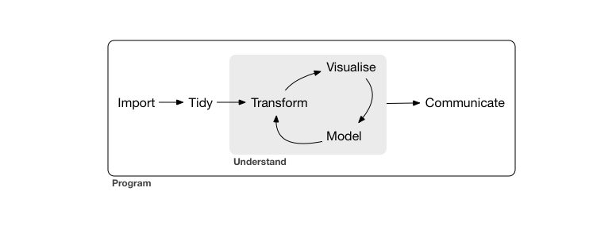

## R history

<div style="float: right; margin-top: -2cm; text-align: right">

<br><br><br>
<div style="display: inline-block; margin: 1em;">

<br>The **new** S language,
<br>published 1988,
<br>introduced functions, ...
</div>
<div style="display: inline-block; margin: 1em;">

<br>Statistical Models in S,
<br>published 1991,
<br>introduced data frames, ...
</div>
</div>

### S - 1976
### R - 1993

<br>
We will be focussing on the modern [Tidyverse](https://tidyverse.org) approach. 

* **"tidy data"**: the data frame ("tibble") is the one true data structure
* `dplyr`, `ggplot2`, `tidyr`, `purrr`, etc
* mostly written by [Hadley Wickham](http://hadley.nz/)
* simpler, safer, and less "helpful"


## Analysis cycle

From the ["R for Data Science" book](http://r4ds.had.co.nz/)



Data analysis isn't just statistical modelling.

*The greatest value of a picture is when it forces us 
<br>to notice what we never expected to see.*

-- John Tukey


## Topics covered today

<br>


For modelling, get started with Data Fluency's "Linear Models in R" workshop.


## Programming

### Use structures such as loops to automate repetitive tasks

```{r eval=F}
for(i in 1:10) {
    do_the_thing(i)
}
```

### Follow a script

```{r eval=F}
source("myscript.R")
```

* Runs script, command by command, to completion (or first error).

Or: use Rmarkdown to produce a document.

### Define new functions for interactive or scripted use

```{r eval=F}
source("myfunctions.R")
```

Or: write an R package.


## Programming, from a scientist's perspective


If every step of your analysis is recorded in an R script, with no manual steps:

* you have a complete record of what you have done
* easy to run entire script with test data
* changes easily tested, poor early decisions easily fixed
* today's big project becomes a function in a package, serves as tomorrow's building block

<br>
Programming is an essential part of **reproducible research**.

* other researchers can precisely understand and verify your work

<!--
Elements of programming we will be looking at today:

* re-usable step-by-step procedures with `function`
* doing something "for each ..." with `for` loops
* making decisions with `if`
* running external software with `system`
* running all the code in a .R file as a "script", or to load a "library" of functions
-->

## Algorithmic thinking

Programming involves two very different activities.

<br>

### 1. Thinking through the problem

* Define the problem precisely.

* Anticipate things that might go wrong or need special handling.

* Come up with a step-by-step solution, using phrases like **"for each"** and **"if"**.

This is **algorithmic thinking**. It doesn't need a computer!

<br>

### 2. Turning the step-by-step solution into R code


## Algorithmic thinking

Suppose you want to add the numbers 5, 3, 9, 7.

We can write down steps to solve this, then convert them to R code.

<br>
<br>

<table width="75%">
<tr><td>
```
Start with a total of 0.

Add 5 to the total.

Add 3 to the total.

Add 9 to the total.

Add 7 to the total.

The total now is the answer.
```
</td><td>
```
total <- 0

total <- total + 5

total <- total + 3

total <- total + 9

total <- total + 7

total
```
</td></tr>
</table>

## Algorithmic thinking

Suppose you want to add up a collection of numbers **in general**.

We can write down steps to solve this, then convert them to R code.

<br>
<br>

<table width="75%">
<tr><td>
```


Start with a total of 0.

For each number x in the collection: 
    Add x to the total.


The answer is the final value of total.

```
</td><td>
```
collection <- c(5, 3, 9, 7)


total <- 0

for(x in collection) {
    total <- total + x
}

total
```
</td>
</tr>
</table>

## Algorithmic thinking

Like a cooking recipe or a lab protocol, we can write down the steps once, then use them whenever we need to solve this problem.

<br>
<br>

<table width="75%">
<tr><td>
```
This is how to add up the numbers in a collection:

    Start with a total of 0.

    For each number x in the collection: 
        Add x to the total.


    The answer is the final value of total.


Now add up 5, 3, 9, and 7.
```
</td><td>
```
addup <- function(collection) {

    total <- 0

    for(x in collection) {
        total <- total + x
    }

    total

}


addup( c(3,5,9,7) )
```
</td></tr>
</table>

## LLMs such as ChatGPT

::: {style="float: right; border-radius: 10px; background: #eee; margin-left: 20px; margin-bottom: 20px; padding: 10px; width: 400px;"}
Write some R code to ...

Please explain this code ...

Suggest a package to ...
:::

* Have seen *a lot* of R and tidyverse code in their training data.
* Can **mimic and adapt** code they've seen to solve your problem.
* Can try to **explain** what code does.
* Can **suggest** relevant packages and functions.

May

* Talk **nonsense**.<br>(I'm especially distrustful on difficult statistical concepts.)
* Suggest things that are slightly out of date.

You should also

* Mess around with suggested code to understand it better.
* Read the documentation.
* Build a mental model.

##

(do programming section)

## Data


<br><br><br><br>
As your programs get more complicated, you will also need ways to represent complex data.

<br>
Often the largest task is to get the data into the right form to apply a tool<br>such as `ggplot`, `summarize`, or `lm`.


## Data


### Vectors

* A collection of a single kind of data:<br>numeric, character, factor, logical
* Single numbers are a vector of length 1.
* Can have `names( )`.

```{r eval=FALSE}
c(x=1, y=2, z=3)
```

### Lists

* A special kind of vector that can hold any kind of data, including other vectors and lists.
* If you need to bundle together a miscellaneous collection of data, lists are your solution. For example, a function that needs to return multiple results can return a list.
* Play the same role as both the `list` and `dict` types in Python, or `object` and `Array` types in Javascript.
* Access individual elements with `[[ ]]` or `$`.

```{r eval=FALSE}
list(x=TRUE, y="two", z=c(1,2,3))
```

## Data


### Data frames

* Data frames hold tabular data where the columns may be different types. 
* Under the hood, a list of column vectors. 
* Tidyverse has an improved data frame called a "tibble".

### Others (not covered today)

* **Matrices** hold tabular data all of the same type, usually numeric.<br>Distinct from data frames in R!<br>Can have `rownames( )` and `colnames( )`.

* **"S3" objects** are (usually) a list, with a special class attribute.<br>Example: an `lm` object holding a linear model.

* **"S4" objects** are a more formal approach to object-orientation.<br>Most heavily used by the Bioconductor project.<br>Example: a `GRanges` object holding genomic ranges.


## Tidy data


Tidy data doesn't mean tidy for a person to read, it means the easiest form for the computer to work with.

* only use data frames
* put all the data in a single data frame
* each row is a single unit of observation
* each column is a single piece of information

Similar to database design.

The experimental design is in the body of the table alongside the data, *not* in row names or column names.

If you have multiple columns containing the same kind of information, this is a hint the data is not tidy.


## Not tidy ...

Example from: [Wickham, H. (2015) Tidy data. The Journal of Statistical Software, vol. 59.](http://vita.had.co.nz/papers/tidy-data.html)


## ... tidier ... tidy


("melt" = "gather" = "pivot_long")

## Learning more


["R for Data Science" by Garret Grolemund and Hadley Wickham](https://r4ds.had.co.nz/)

* good general introduction, more detail on most topics covered today

[RStudio's cheat sheets](https://www.rstudio.com/resources/cheatsheets/)

* good to discover what exists

[Hadley Wickham's website](http://hadley.nz/) 

* further books on Advanced R and R package development

[Official R manuals](https://cran.r-project.org/manuals.html)

* complete description of the R language


##

(do tidyverse section)


