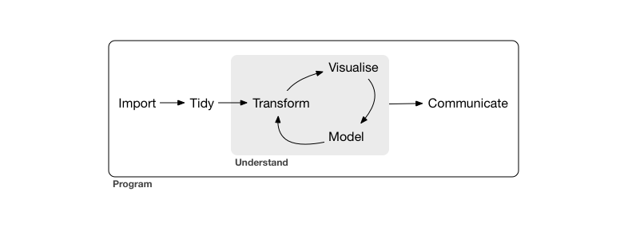

This lesson covers packages primarily by Hadley Wickham for tidying data and then working with it in tidy form, collectively known as the "tidyverse".

::: {.omit}
The packages we are using in this lesson are all from CRAN, so we can install them with `install.packages`. If you did this while setting up for this workshop, you won't need to do it again now.
:::

```{r eval=FALSE}
# install.packages("tidyverse")
```

```{r warning=FALSE, message=FALSE}
library(tidyverse) # Load all "tidyverse" libraries.
# OR
# library(readr)   # Read tabular data.
# library(tidyr)   # Data frame tidying functions.
# library(dplyr)   # General data frame manipulation.
# library(ggplot2) # Flexible plotting.
```

These packages usually have useful documentation in the form of "vignettes". These are readable on the CRAN website, or within R:

```{r eval=FALSE}
vignette()
vignette(package="dplyr")
vignette("dplyr", package="dplyr")
```


We will continue using the FastQC output data frame. If you're starting fresh for this lesson, load it with:

```{r}
bigtab <- read_csv("r-progtidy-files/fastqc.csv")
```

# dplyr

`dplyr` gives us a collection of convenient "verbs" for manipulating data frames. The name is a contraction of "Data frame apPLYeR", as some of these verbs have a similar flavour to `apply`/`lapply`/`tapply`/etc.

Each verb takes a data frame as input and returns a modified version of it. The idea is that complex operations can be performed by stringing together a series of simpler operations in a pipeline.

```
# input         +--------+        +--------+        +--------+      result
#  data    |>   |  verb  |   |>   |  verb  |   |>   |  verb  |  ->   data
#   frame       +--------+        +--------+        +--------+        frame
```

::: {.omit}
Some of these verbs are covered in our [introductory R workshop](https://monashdatafluency.github.io/r-intro-2/data-frames.html), so some of this may be familiar already.
:::

## Tibbles

Because we used `readr` to read the data, `bigtab` is a "tibble", which is the Tidyverse's improved data frame. 

```{r}
bigtab
```

::: {.omit}
You can also create tibbles explicitly with the `tibble` function. One convenient feature is that it only shows a few rows of the data frame when you print it. If you do want to see the whole table, you can use `as.data.frame`, or use the `View` function to view it in a tab.
:::

```{r eval=FALSE}
as.data.frame(bigtab)
View(bigtab)
```

The `n` and `width` arguments to `print` can also be used to print more rows or columns respectively.

```{r eval=FALSE}
print(bigtab, n=100, width=1000)
```


## filter( )

Say we want to know all the tests that failed. `filter` provides a convenient way to get rows matching a query.

```{r}
filter(bigtab, grade == "FAIL")
```

::: {.omit}
Something is magic here: we do not have `grade` in our environment, only within the data frame. Arguments to `filter` can use any column of the data frame as a variable. `dplyr` uses this idea heavily, arguments to `dplyr` verbs often behave in a special way.
:::

## arrange( )

Rather than filtering, we might instead want to sort the data so the most important rows are at the top. `arrange` sorts a data frame by one or more columns.

```{r}
arrange(bigtab, grade)

# desc( ) can be used to reverse the sort order
arrange(bigtab, desc(grade))
```


## Joins

Say we want to convert PASS/WARN/FAIL into a numeric score, so we can produce some numerical summaries. The scoring scheme will be:

```{r}
fwp <- c("FAIL","WARN","PASS")
scoring <- tibble(grade=factor(fwp,levels=fwp), score=c(0,0.5,1))

scoring
```

::: {.omit}
`dplyr` has several join functions, including `left_join`, `right_join`, `inner_join`, `full_join`, and `anti_join`. The difference between these functions is what happens when there is a row in one data frame without a corresponding row in the other data frame. `inner_join` discards such rows. `full_join` always keeps them, filling in missing data with NA. `left_join` always keeps rows from the first data frame. `right_join` always keeps rows from the second data frame. `anti_join` is a bit different, it gives you rows from the first data frame that *aren't* in the second data frame.
:::

We can use a join to augment a data frame with some extra information. `left_join` is a good default choice for this as it will never delete rows from the data frame that is being augmented.

```{r}
scoretab <- left_join(bigtab, scoring, by="grade")
scoretab
```

The grade columns act as the *keys* of the two data frames, allowing corresponding rows in the data frames to be joined together.

::: {.omit}
One important thing that all the join functions do: if multiple rows have the same key in either data frame, all ways of combining the two sets of rows will be included in the result. So, here, rows from the scoring data frame have been copied many times in the output. 

Joins are the key tool for *integrating* different types of data, based on some common key such as gene ID.

<b>See also:</b> `match` and `merge` in base R.
:::


## summarize( )

`summarize` lets us compute summaries of data.

```{r}
summarize(scoretab, average_score=mean(score))
```

::: {.omit}
In this, `average_score` is used to name the new column. Any summary function could be used in place of `mean`, such as `sum`, `median`, `sd`.
:::

We really want to summarize the data grouped by file, so we can see if there are any particularly bad files. This is achieved using the `.by` argument, which names a column or columns to group by. Each group will then produce a single row in the output:

```{r}
summarize(scoretab, average_score=mean(score), .by=file)
```

For completeness, we should also mention an older way of doing this with the `group_by` helper function, which associates a grouping with the tibble:

```{r}
group_by(scoretab, file)

summarize(group_by(scoretab, file), average_score=mean(score))
```

The special function `n()` can be used within `dplyr` verbs such as `summarize` to get the number of rows.

```{r}
summarize(scoretab, count=n(), .by=grade)
```

::: {.omit}
**See also:** shortcut functions for simple uses of summarize `count` and `distinct`.

**See also:** `table` and `tapply` in base R.

**Tip:** Other verbs also have a `.by` argument or can be used with `group_by`, such as mutate. This is more advanced than we will be going into today. Grouping with `group_by` can be removed with `ungroup`.

**Tip:** You can group by multiple columns using `c( )`, for example `.by=c(file, grade)`.
:::

## The pipe |>

Suppose we wanted to sort the files by their average score. We could write:

```{r eval=FALSE}
arrange(summarize(scoretab, average_score=mean(score), .by=file), average_score)
```

Writing code like this quickly gets confusing! 

We often want to take the result of one `dplyr` function and feed it into another, and another. R's pipe operator, `|>`, provides a more readable way to tod this. The pipe operator takes the value on the left, and passes it as the first argument to the function call on the right. So instead we could write:

```{r eval=FALSE}
scoretab |> summarize(average_score=mean(score), .by=file) |> arrange(average_score)
```

For readability we will often write a pipeline over several lines:

```{r}
scoretab |> 
    summarize(average_score=mean(score), .by=file) |> 
    arrange(average_score)
```

In older books and web pages you may see `%>%` used instead of `|>`. This is a predecessor to the now standardized R pipe, defined in the `magrittr` package.

`|>` isn't limited to `dplyr` functions. It's an alternative way of writing any R code.

```{r}
rep(paste("hello", "world"), 5)

"hello" |> paste("world") |> rep(5)
```

::: {.omit}
The idea of adding geoms in `ggplot2` is rather like piping in `dplyr`. I suspect the only reason pipes aren't used in `ggplot2` is that it predates `dplyr` and the invention of the pipe.
:::

### Challenge {.challenge}

Write a pipeline using `|>`s that starts with `bigtab`, joins the `scoring` table, and then calculates the average score for each test.


## mutate( )

A couple more verbs will complete our core vocabulary. `mutate` lets us add or overwrite columns by computing a new value for them.

```{r eval=F}
mutate(scoretab, doublescore = score*2)
```

Equivalently:

```{r}
scoretab |>
    mutate(doublescore = score*2)
```

Even though this is called "mutate", it is not literally modifying the input. Rather it is producing a copy of the data frame that has the modification.

The above is equivalent to:

```{r eval=FALSE}
scoretab2 <- scoretab
scoretab2$doublescore <- scoretab2$score * 2
```


## select( )

dplyr's `select` function is for subsetting, renaming, and reordering *columns*. Old columns can be referred to by name or by number.

```{r}
select(bigtab, test,grade) 
select(bigtab, 2,1)
select(bigtab, foo=file, bar=test, baz=grade)
```

`select` has a special syntax for more complicated column selections. Read about it [here](https://dplyr.tidyverse.org/reference/dplyr_tidy_select.html). For example, you can remove a specific column like this:

```{r}
select(bigtab, !file)
```

::: {.omit}
With `filter`, `arrange`, `mutate`, `select`, `summarize`, and joins, we have a core vocabulary for manipulating data frames in pipelines.
:::

# tidyr

`tidyr` is the Tidyverse package for getting data frames to tidy. In a tidy data frame:

* each row is a single unit of observation
* each column is a single piece of information

::: {.omit}
I'm not convinced `tidyr` is a great package, but the *ideas* behind it are very important. `dplyr` uses magic arguments to produce beautiful R code, but in `tidyr` it gets a bit confusing. Anyway, let's work through a toy example:
:::

```{r}
untidy <- read_csv(
    "country,     male-young, male-old, female-young, female-old
     Australia,            1,        2,            3,          4
     New Zealand,          5,        6,            7,          8")
untidy
```

In this example, the first problem is that rows are not distinct units of observation, there are actually four observations per row. This is fixed using `pivot_longer`. (This operation has in the past also been called `gather` or `melt`.)

```{r}
longer <- pivot_longer(untidy, cols=!country, names_to="group", values_to="cases")
longer
```

::: {.omit}
We give a data frame, a specification of columns to use (`cols=`), a column to put the column names in (`names_to=`) and a column to put the values in (`values_to=`). The column specification [behaves like `select`](https://dplyr.tidyverse.org/reference/dplyr_tidy_select.html). Here we've asked to used all columns except `country`. We could equivalently have put `cols=2:5`.
:::

`pivot_wider` is the opposite operation, spreading two columns into many columns, which generally makes data less tidy but is sometimes necessary. 
A common application is producing a scatter plot, where the x and y axes need to be two different columns even though they measure the same type of thing. Data may also be easier to look at in a table in spread form.

```{r}
pivot_wider(longer, names_from=group, values_from=cases)

pivot_wider(bigtab, names_from=file, values_from=grade)
```

In our toy example, we have a further problem that the "group" column contains two pieces of data. This can be fixed with `separate`. By default `separate` splits on any non-alphanumeric characters, but different separator characters can be specified.

```{r}
separate(longer, col=group, into=c("gender","age"))
```

All of this would typically be written as a single pipline:

```{r}
tidied <- untidy |>
    pivot_longer(cols=!country, names_to="group", values_to="cases") |>
    separate(group, into=c("gender","age"))
```

Finally, we mention that `pivot_longer` has features we haven't explored, and it is actually possible to do this in one step. [See the tidyr vignettes.](https://tidyr.tidyverse.org/articles/pivot.html)

```{r}
pivot_longer(
    untidy, cols=!country, 
    names_to=c("gender","age"), names_sep="-", values_to="cases") 
```

::: {.omit}
<b>Advanced:</b> `tidyr` has a number of other useful data frame manipulations. For completeness, we mention `nest`. This creates a *list column* in a tibble, the list column containing one tibble per row. Yo, Hadley put tibbles in your tibble so you can dplyr while you dplyr. The inverse operation is `unnest`. `unnest` is rather like the `bind_rows` function we saw earlier. `nest` and `unnest` go well with creating or modifying list columns in a `mutate` with `lapply` (or the [`purrr`](https://purrr.tidyverse.org/) package).
:::

```{r eval=FALSE}
# Advanced
nested <- nest(tidied, data=c(gender, age, cases))
nested
nested$data
unnest(nested, data)
```


### Challenge {.challenge}

You receive data on a set of points. The points are in two dimensions (`dim`), and each point has x and y coordinates. Unfortunately it looks like this:

```{r eval=FALSE}
df <- read_csv(
    "dim, E_1, E_2, M_1, M_2, M_3, M_4, M_5
     x,   2,   4,   1,   2,   3,   4,   5
     y,   4,   4,   2,   1,   1,   1,   2")
```

1. Tidy the data by pivoting longer all of the columns except `dim`. What does each row now represent?

2. We want to plot the points as a scatter-plot, using either `plot` or `ggplot`. Pivot the long data wider so that this is possible. Now what do the rows represent?

3. The data seems to be divided into "E" and "M" points. How could we make a column containing "E"s and "M"s?


# Other Tidyverse packages

They Tidyverse contains quite a few packages. Here are a few more packages I find myself using often:

* `stringr` for string manipulation. Sometimes `separate` is not quite flexible enough, so I'll wrangle and disentangle strings with functions like `str_replace_all` and `str_match`.

* `forcats` for manipulating factors.

* `purrr` for `lapply`-like operations.

* `lubridate` for date and time parsing and manipulation.


# An RNA-Seq example

::: {.omit}
We will now put this all together by looking at a small-scale gene expression data set. To simplify somewhat: The data was generated from a multiplex PCR targetting 44 genes. The PCR product is quantified by counting reads from high throughput sequencing. The experiment is of yeast released synchronously into cell cycling, so that we can see which genes are active at different points in the cycle. Several strains of yeast have been used, a wildtype and several gene knock-downs. Each has nine time points, covering two cell cycles (two hours). 

This is much smaller than a typical RNA-Seq dataset. We are only looking at 44 genes, rather than all of the thousands of genes in the yeast genome.

Recall the diagram from the ["R for Data Science" book](http://r4ds.had.co.nz/). We will here focus on the "import", "tidy", "transform", and "visualize" steps.


:::

## Importing and tidying

**Hint:** You can select from the top of a pipeline to partway through and press Ctrl-Enter or Command-Enter to see the value part-way through the pipeline.

```{r}
# Use readr's read_csv function to load the file
counts_untidy <- read_csv("r-progtidy-files/read-counts.csv")

counts <- counts_untidy |>
    pivot_longer(cols=!Feature, names_to="sample", values_to="count") |>
    separate(sample, sep=":", into=c("strain","time"), convert=TRUE, remove=FALSE) |>
    mutate(
        sample = factor(sample, levels=unique(sample)),
        strain = factor(strain, levels=c("WT","SET1","RRP6","SET1-RRP6"))
    ) |>
    filter(time >= 2) |>
    select(sample, strain, time, gene=Feature, count)

summary(counts)
```

::: {.omit}
Time point 1 was omitted because it isn't actually part of the time series, it's from cells in an unsynchronized state. If we wanted to be even tidier, the remaining time points could be recoded with the actual time within the experiment -- they are at 15 minute intervals.
:::

## Transformation and normalization

```{r}
ggplot(counts, aes(x=sample, y=count)) + 
    geom_boxplot() + 
    coord_flip()
```

::: {.omit}
We immediately see from a [Tukey](https://www.amazon.com/Exploratory-Data-Analysis-John-Tukey/dp/0201076160/ref=sr_1_1?s=books&ie=UTF8&qid=1469077563&sr=1-1) box plot that the data is far from normal -- there are outliers many box-widths to the right of the box. 
:::

Perhaps a log transformation is in order.

```{r}
ggplot(counts, aes(x=sample, y=log2(count))) + 
    geom_boxplot() + 
    coord_flip()

ggplot(counts, aes(x=log2(count), group=sample)) + 
    geom_line(stat="density")
```

Log transformation has greatly improved things, although now there are more outliers left of the whiskers, and some zeros we will need to be careful of. We also see one of the samples has less reads than the others.

The gene SRP68 was included as a control housekeeping gene. Its expression level should be the same in all samples. We will divide counts in each sample by the count for SRP68 to correct for library size, then log-transform the data. We add a small constant when log-transforming so that zeros do not become negative infinity (as if adding 1 further read count to an average sample).

```{r}
normalizer <- counts |>
    filter(gene == "SRP68") |>
    select(sample, norm=count)

moderation <- 1/mean(normalizer$norm)

counts_norm <- counts |>
    left_join(normalizer, by="sample") |>
    mutate(
        norm_count = count/norm, 
        log_norm_count = log2(norm_count+moderation)
    )

ggplot(counts_norm, aes(x=sample, y=log_norm_count)) + 
    geom_boxplot() + 
    coord_flip()
```

::: {.omit}
**Note:** Here all of the genes are potentially differentially expressed. For a full RNA-Seq data set we would probably assume most genes aren't differentially expressed, so rather than nominating a normalizing gene we would normalize by total library size with, typically with a slight adjustment using the "TMM" method as calculated by `calcNormFactors` in `edgeR`:
:::

```{r eval=FALSE}
# For a full sized RNA-Seq dataset:
library(edgeR)
mat <- counts_untidy |> 
    column_to_rownames("Feature") |> 
    as.matrix()
adjusted_lib_sizes <- colSums(mat) * calcNormFactors(mat)
normalizer_by_tmm <- tibble(
    sample=names(adjusted_lib_sizes), 
    norm=adjusted_lib_sizes)
```

(In practice, with a full size RNA-Seq dataset I would use the `edgeR` function `cpm`, which performs the same type of normalization and log transformation as above.)

Whatever your data is measuring, two common themes are:

1. Measurement is usually normalized relative to *something* (housekeeping gene, overall library size, microscope image resolution, a ruler in a photograph, calibration run of a machine, ...).

2. If the measurement is by nature a positive number, consider log transformation. Two further indications this is appropriate are if you expect the effects of treatmeants to be multiplicative, or if the noise level scales with the magnitude of the measurement.

## Visualization

The data is now suitably transformed and normalized for visualization. `ggplot2` gives us a lot of freedom to juxtapose information from different columns.

Heatmaps using `geom_tile` and the use of facets allow the entire dataset to be viewed at once.

```{r fig.width=8, fig.height=8}
ggplot(counts_norm, aes(x=sample, y=gene, fill=log_norm_count)) + 
    geom_tile() + 
    scale_fill_viridis_c() + 
    theme_minimal() +
    theme(axis.text.x=element_text(           # Vertical text on x axis
              angle=90,vjust=0.5,hjust=1))              
```

Facetting the heatmap makes it easier to understand.

```{r fig.width=8, fig.height=8}
ggplot(counts_norm, aes(x=time, y=gene, fill=log_norm_count)) + 
    geom_tile() + 
    facet_grid(~ strain) + 
    scale_fill_viridis_c() + 
    theme_minimal()
```

We are interested in the interaction of strain and time, so we can instead set these as the x and y axes for each gene.

```{r fig.width=10, fig.height=8}
ggplot(counts_norm, aes(x=time, y=strain, fill=log_norm_count)) + 
    geom_tile() + 
    facet_wrap(~ gene) + 
    scale_fill_viridis_c() + 
    theme_minimal()
```

::: {.omit}
A famous paper by Cleveland and McGill [-@cleveland1984] ranks color last in terms of perceptual accuracy. Perhaps a different type of plot will be better?
:::
 
A more traditional way of examining the interaction between two factors is a line graph called an "interaction plot". 
We can also give each gene a separate scale.

```{r fig.width=10, fig.height=8}
ggplot(counts_norm, aes(x=time, y=log_norm_count, color=strain, group=strain)) + 
    geom_line() + 
    facet_wrap(~ gene, scale="free")
```


### Exercises {.challenge}

1. Which are the three most variable genes?

Hint: `intToUtf8(utf8ToInt("xvh#jurxsbe|/#vxppdul}h/#vg/#dqg#duudqjh")-3)`

2. Different genes have different average expression levels, but what we are interested in is how they change over time. Further normalize the data by subtracting the average for each gene from `log_norm_count`.

###

```{r}
sessionInfo()
```

::: {.omit}
**References**
:::

